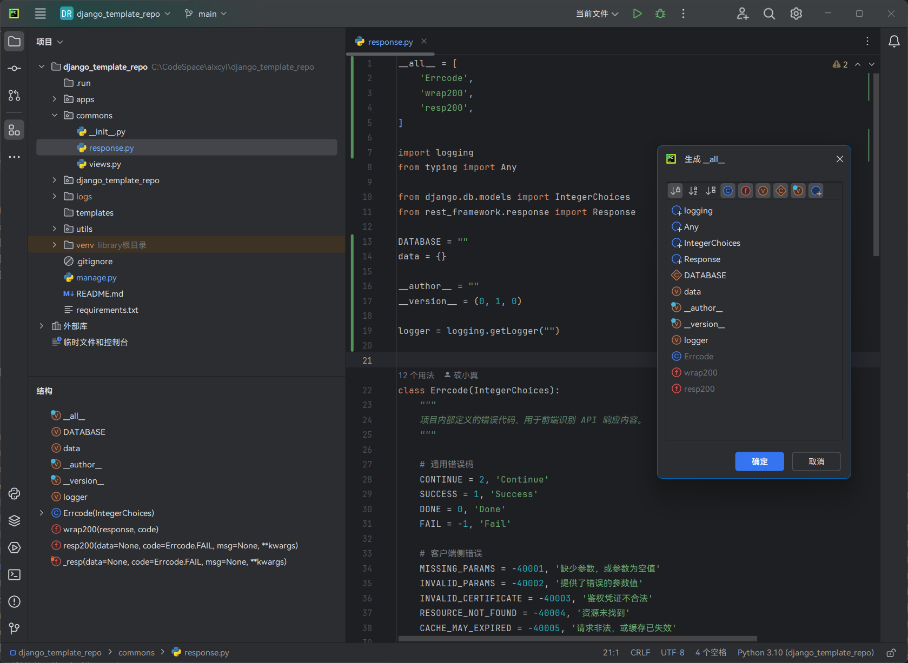

# HooTool - Python Dunder All

[简体中文](./README.md)／[English](./README_EN.md)／...

一个面向 [PyCharm](https://www.jetbrains.com/zh-cn/pycharm/) 的插件，提供
[`__all__`](https://docs.python.org/zh-cn/3/tutorial/modules.html#importing-from-a-package)
的生成与格式化能力。

## 功能

选择文件中出现（或导入）的符号，生成或覆盖 `__all__` 的值（一个字符串列表）。

- 菜单：代码 → 生成... → \_\_all\_\_
- 菜单：代码 → 生成... → \_\_all\_\_（包含导入）

格式化 `__all__` 的值，例如调整字符串列表的顺序、切换字符串引号的风格、改变列表字面值的换行方式等。

- 菜单：代码 → 优化 \_\_all\_\_
- macOS 快捷键：`Control` + `Meta` + `D`
- Windows 快捷键：`Ctrl` + `Shift` + `D`

## 兼容性

- PyCharm
  社区版及专业版（详见[插件市场](https://plugins.jetbrains.com/plugin/24821-hootool--python-dunder-all/versions/)）
- 基于 IntelliJ 的 IDE（需要配合插件 [Python](https://plugins.jetbrains.com/plugin/631-python)
  或 [Python Community Edition](https://plugins.jetbrains.com/plugin/7322-python-community-edition)）
- _未对其它平台进行测试_

## 链接

- [插件市场](https://plugins.jetbrains.com/plugin/24821-hootool--python-dunder-all/)
- [问题追踪（GitHub）](https://github.com/aixcyi/intellij-dunder-all/issues/)
- [问题追踪（码云）](https://gitee.com/aixcyi/intellij-dunder-all/issues/)
- [QQ群 699090940](https://qm.qq.com/q/gPK9D7nBOU)
