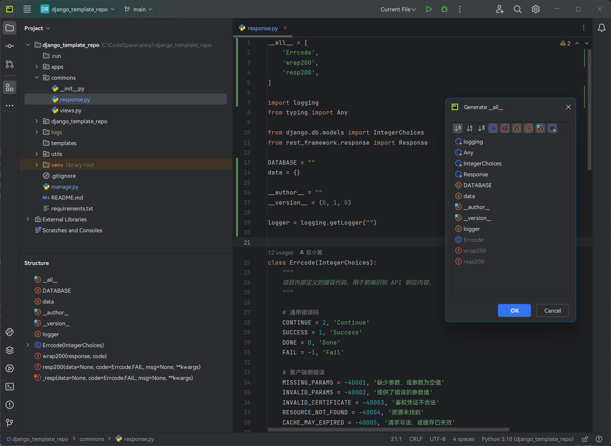

# HooTool - Python Dunder All

[简体中文](./README.md)／[English](./README_EN.md)／...

A plugin for [PyCharm](https://www.jetbrains.com/pycharm/), provides Python
[`__all__`](https://docs.python.org/3/tutorial/modules.html#importing-from-a-package)
generation and optimization.

## Features

Select symbols defined (or imported) on current file, and generate `__all__` (a string list) or override it.

- Menu：Code → Generate... → \_\_all\_\_
- Menu：Code → Generate... → \_\_all\_\_ (with imports)

Optimize `__all__` 's value. You can adjust list order,
toggle string quotes (between single and double),
switch line breaking (between filling line and putting one symbol per line), etc.

- Menu：Code → Optimize \_\_all\_\_
- macOS Shortcut：`Control` + `Meta` + `D`
- Windows Shortcut：`Ctrl` + `Shift` + `D`

## Compatibility

- PyCharm, both Community and Professional Edition,
  see [Marketplace](https://plugins.jetbrains.com/plugin/24821-hootool--python-dunder-all/versions/) for detail
- IntelliJ-based IDE (depends on [Python](https://plugins.jetbrains.com/plugin/631-python)
  or [Python Community Edition](https://plugins.jetbrains.com/plugin/7322-python-community-edition))
- _Not tested on other platforms_

## Links

- [JetBrains Marketplace](https://plugins.jetbrains.com/plugin/24821-hootool--python-dunder-all/)
- [Issue Tracker \(GitHub\)](https://github.com/aixcyi/intellij-dunder-all/issues)
